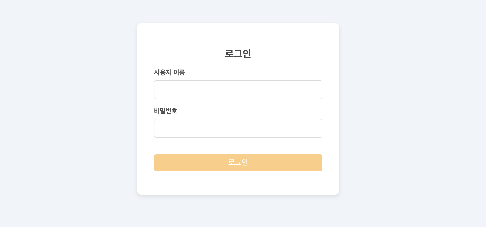
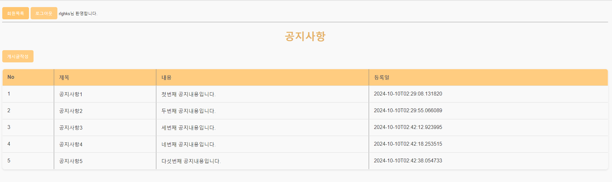
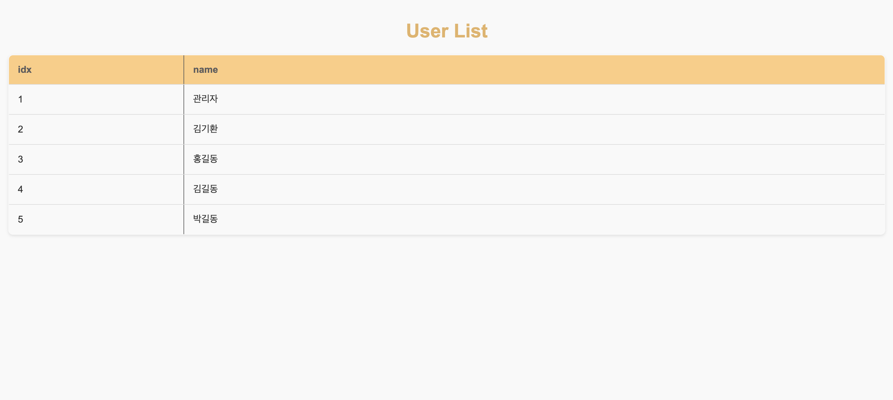
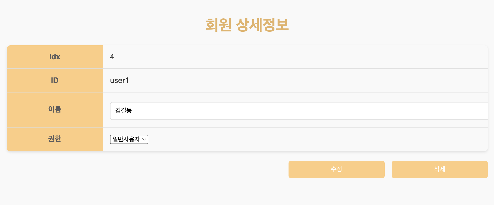
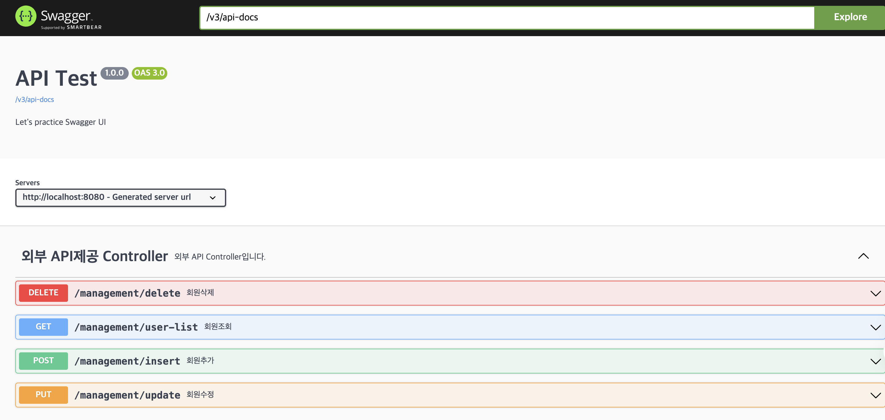

# 프로젝트 이름
로그인·로그아웃 및 페이지 구현 & 회원 관리 API (사전과제)

## 화면

  로그인

   
  
   

  메인페이지

   
  
   

  회원목록

   
  
   

  회원수정

   
  
   

 

## 기술 스택

| JavaScript | springboot |  MariaDB |
| :--------: | :--------: | :------: |
|      |      |    |

 
 

## API 명세

### Springdoc Swagger UI

  Swagger

   
  
   

 
